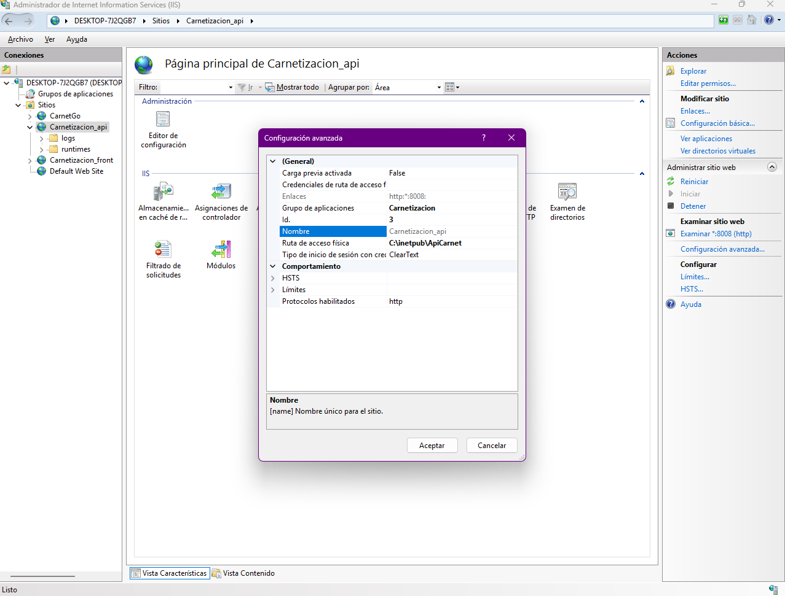
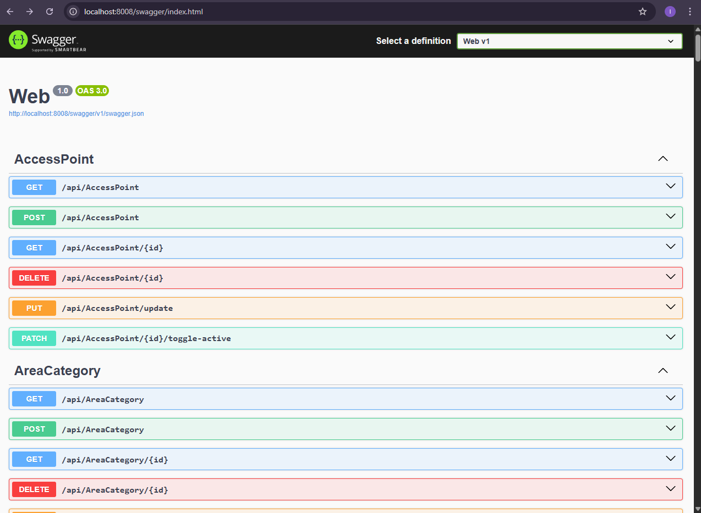
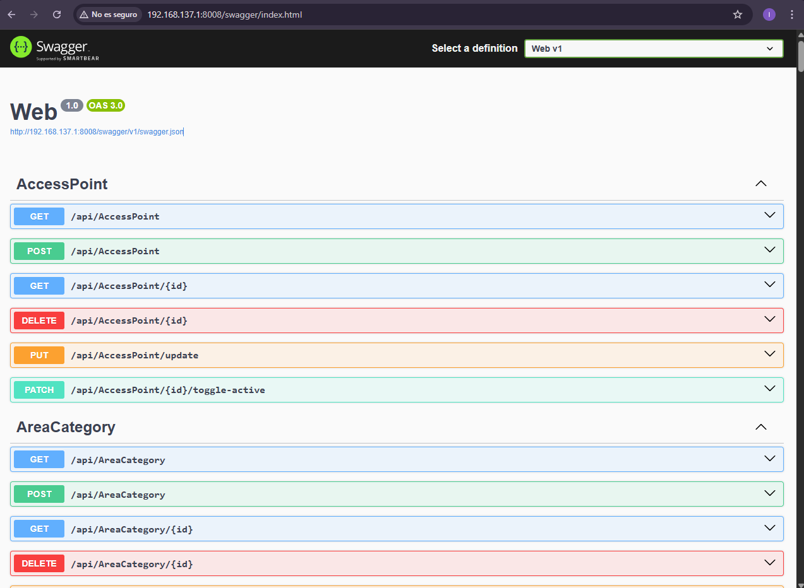

# EVIDENCIA DESPLIEGUE - IIS

Este documento contiene las evidencias del despliegue de la **API** para el proyecto CARNETIZACIÓN DIGITAL en **IIS**, comprobando que el servicio está corriendo y accesible desde  dispositivos.

---

## Pasos principales

1. **Publicación del proyecto en Visual Studio**  
   - Proyecto → Publicar → Carpeta `publish/`.

2. **Configuración en IIS**  
   - Crear *Application Pool* con la versión adecuada de .NET.  
   - Crear un nuevo *Sitio Web* en IIS apuntando a la carpeta publicada.  
   - Configurar *Bindings* con el puerto asignado.  
   - Habilitar permisos de lectura y ejecución.

3. **Prueba local en servidor**  
   - `http://localhost:8008/swagger`

4. **Prueba en otro dispositivo en la red**  
   - `http:// 192.168.137.1:8008/swagger`

---

## Evidencias

- IIS configurado con la API  
  

- Swagger corriendo en servidor  
  
  

- API accesible desde dispositivo móvil  
  

---

## 🔗 URLs de acceso

- **Servidor local:** `http://localhost:8008/swagger`  
- **Red interna:** `http:// 192.168.137.1:8008/swagger`

---

## ⚡ Conclusiones

- La **API** corre correctamente en **IIS**.  
- Se verificó acceso desde servidor y dispositivos de la red.  
