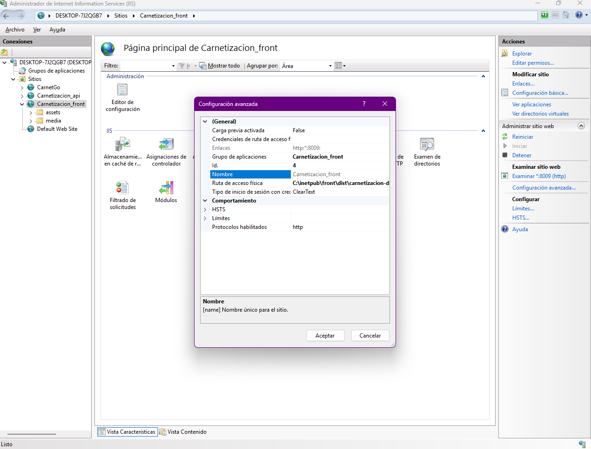
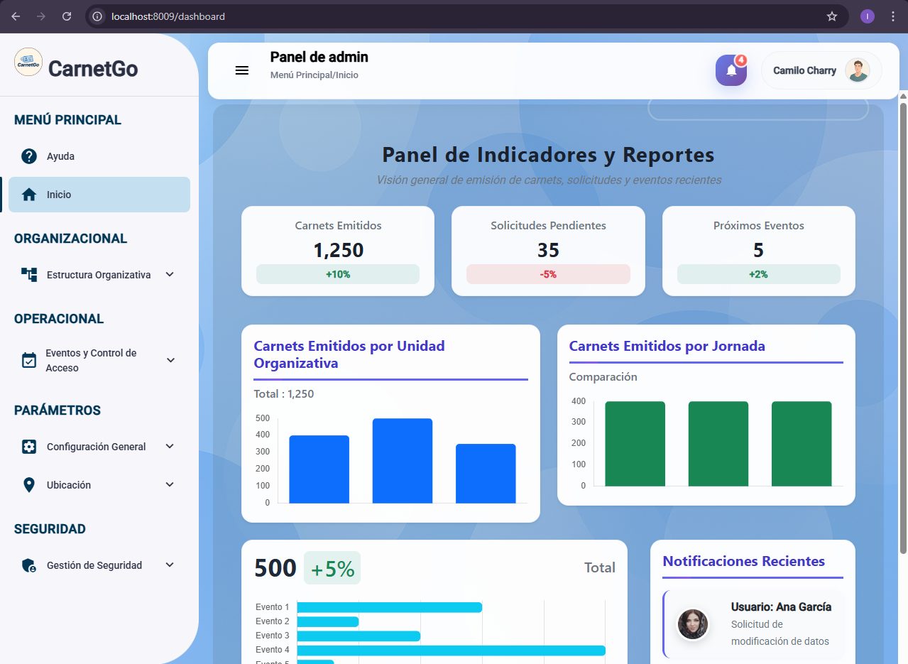
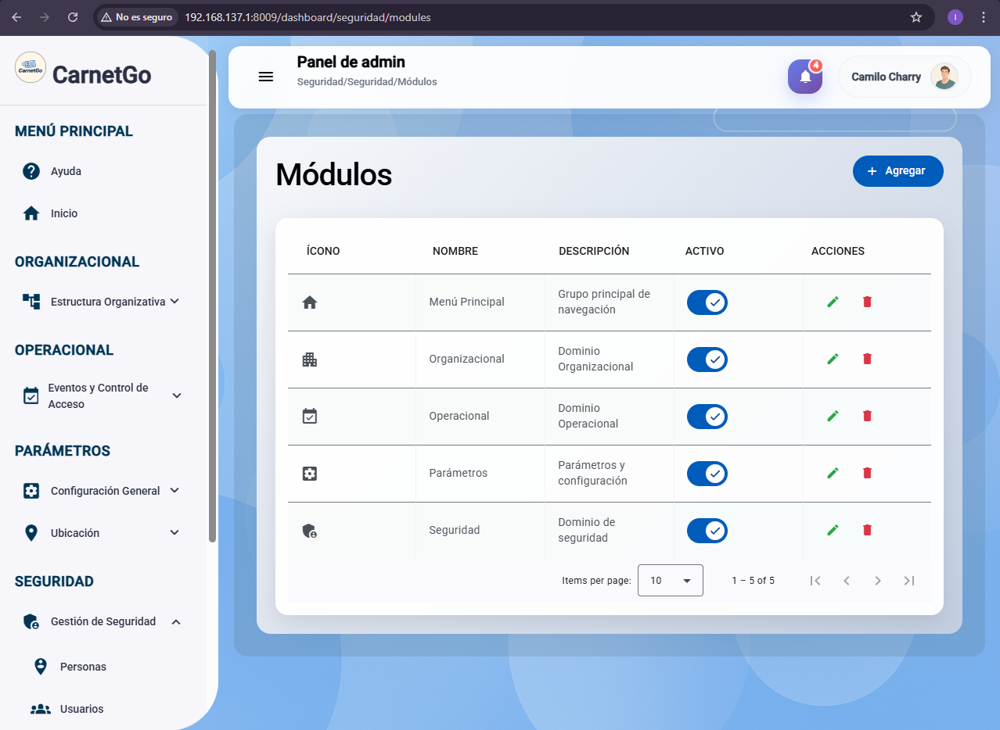
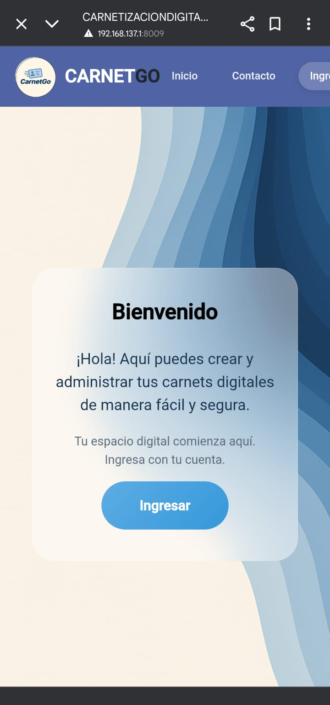
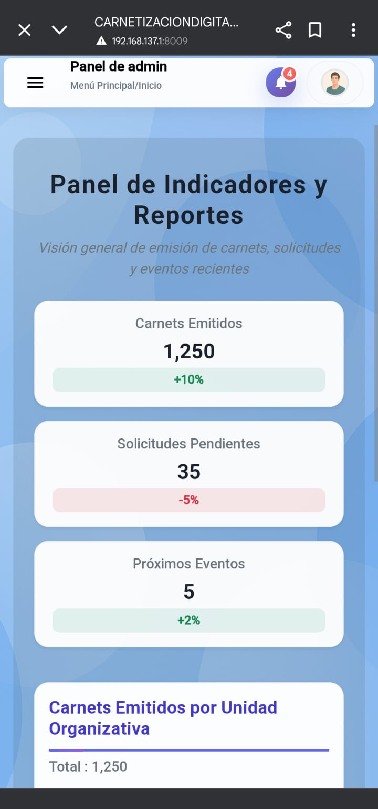
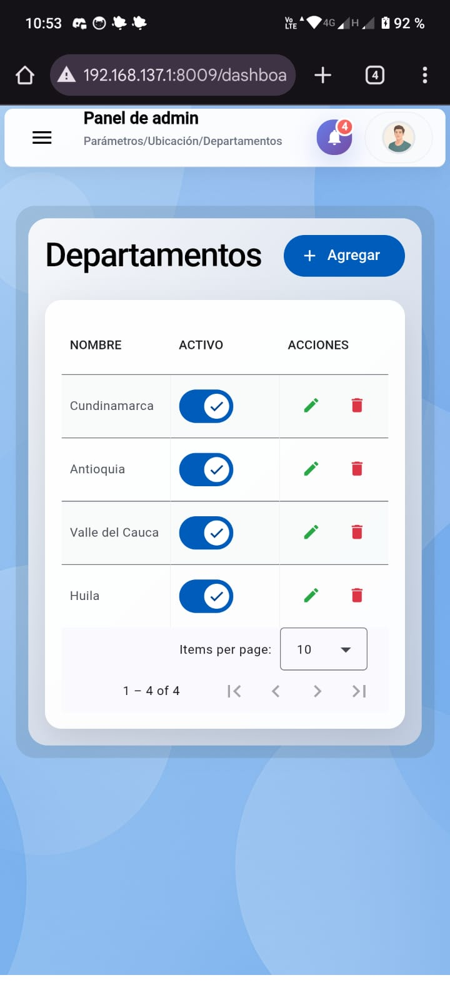
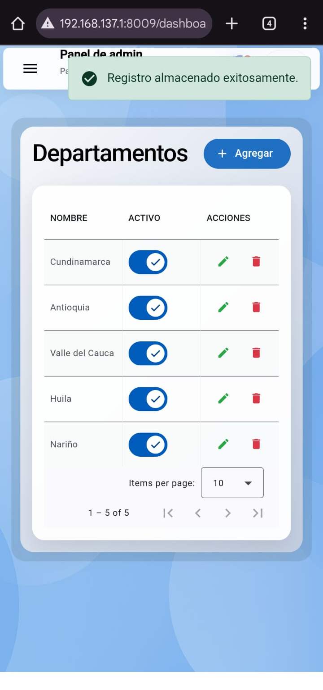

# EVIDENCIA DESPLIEGUE - IIS

Este documento contiene las evidencias del despliegue del **Frontend Angular** para el proyecto CARNETIZACIÓN DIGITAL en **IIS**, comprobando que la aplicación está corriendo y accesible desde dispositivos, y que **consume los servicios del Backend también desplegado en IIS**.

---

## Pasos principales

1. **Generación del build de Angular**

   ```bash
   ng build --configuration production
   ```

   - Esto generó la carpeta `/dist/carnetizacion-digital-front`.

2. **Configuración en IIS**

   - Crear un nuevo _Sitio Web_ en IIS apuntando al directorio `dist/carnetizacion-digital-front`.
   - Configurar _Bindings_ con el puerto asignado.
   - Incluir archivo `web.config` para manejo de rutas SPA (Angular).

3. **Prueba local en servidor**

   - `http://localhost:8009`

4. **Prueba en otro dispositivo en la red**

   - `http://192.168.137.1:8009`

5. **Integración con el Backend (API en IIS)**
   - El frontend consume la API disponible en:
     - `http://192.168.137.1:8008/api`

---

## Evidencias

- IIS configurado con el Frontend  
  

- Aplicación cargando en navegador del servidor  
  
  

- Aplicación accesible desde dispositivo móvil  
  
  

- Consumo de datos desde el Backend desplegado en IIS  
  
  

---

## 🔗 URLs de acceso

### Frontend

- **Servidor local:** `http://localhost:8009`
- **Red interna:** `http://192.168.137.1:8009`

### Backend (consumido por el Frontend)

- **Servidor local:** `http://localhost:8008/api`
- **Red interna:** `http://192.168.137.1:8008/api`

---

## ⚡ Conclusiones

- El **Frontend Angular** corre correctamente en **IIS local**.
- Se verificó acceso desde servidor y dispositivos de la red.
- La aplicación **consume exitosamente el Backend desplegado también en IIS**, validando la integración de ambos componentes.
