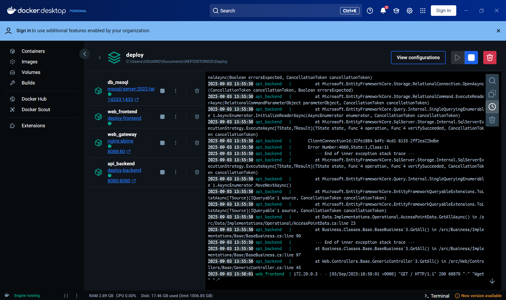
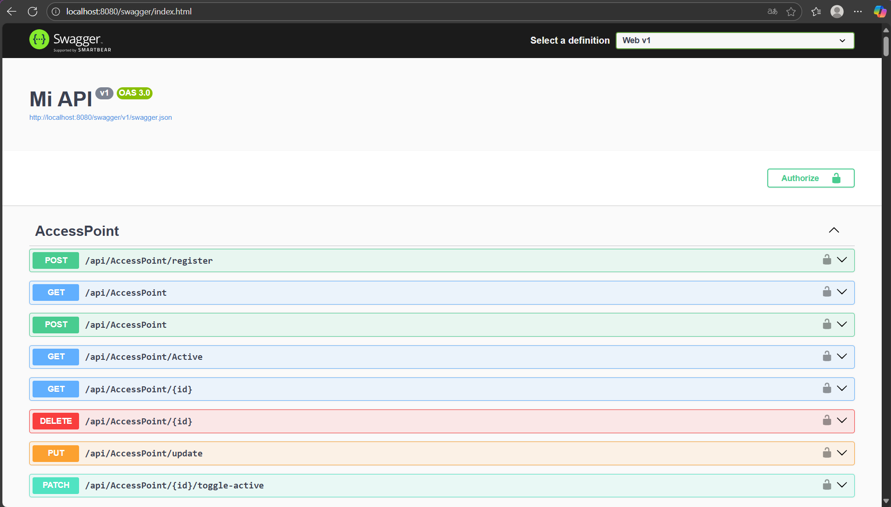

# Despliegue con Docker

En la siguiente imagen se observa la orquestación de servicios en
**Docker** a partir de un archivo `docker-compose.yml`.

## Descripción

Se crearon y configuraron los siguientes servicios:

-   **db_mssql** → Contenedor con la imagen oficial
    `mcr.microsoft.com/mssql/server:2022-latest`.
-   **web_frontend** → Aplicación de frontend construida a partir de un
    `Dockerfile` propio.
-   **api_backend** → API backend construida a partir de un `Dockerfile`
    propio.
-   **web_gateway** → Servicio `nginx:alpine` usado como
    **gateway/reverse proxy**. El gateway actúa como punto de entrada
    único para los clientes, recibiendo las peticiones y redirigiéndolas
    al servicio correspondiente (frontend o backend). Esto facilita la
    gestión de rutas, balanceo de carga y seguridad.

Cada servicio se administra y levanta mediante el archivo
`docker-compose.yml`, el cual orquesta las dependencias y puertos
expuestos.

## Flujo general

1.  Se construyó un **Dockerfile** en el proyecto **backend** para
    empaquetar la API.
2.  Se construyó un **Dockerfile** en el proyecto **frontend** para
    empaquetar la interfaz web.
3.  Con `docker-compose` se orquestaron los servicios junto a la base de
    datos y el proxy.
4.  Los contenedores se visualizan y gestionan desde **Docker**, como se
    muestra en la captura.

## Resumen

Este entorno permite: 
- Desplegar la aplicación completa con un solo comando (`docker-compose up`). 
- Integrar backend, frontend, base de datos y gateway en un mismo ecosistema. 
- Visualizar logs y estado de contenedores en tiempo real desde **Docker**.
