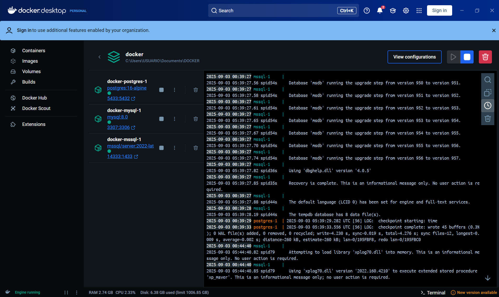
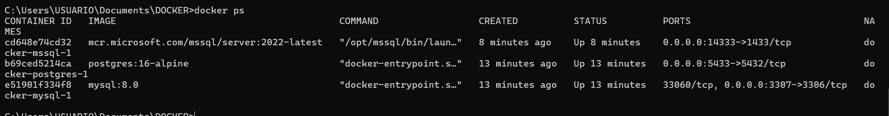
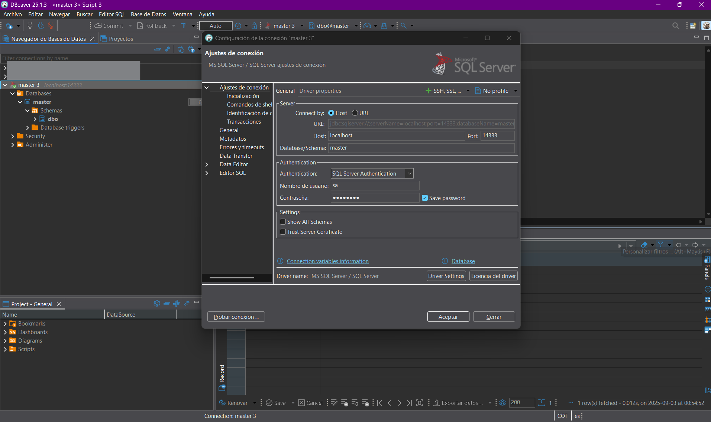
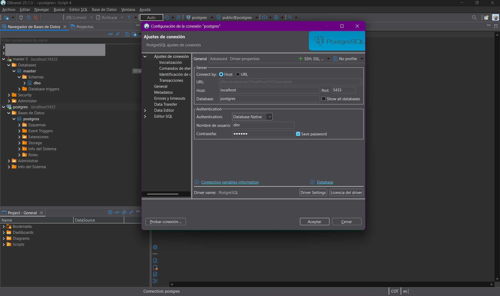
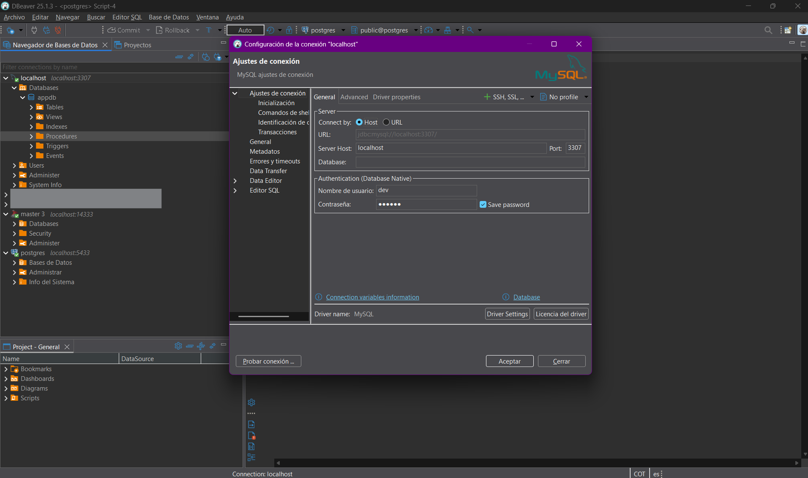

# EVIDENCIA DESPLIEGUE - DOCKER

Este documento contiene las evidencias del despliegue de los gestores de bases de datos **SQL Server**, **PostgreSQL** y **MySQL** en **Docker**, comprobando que los tres servicios están corriendo y accesibles desde aplicaciones externas.

---

## Pasos principales

1. **Creación del archivo `docker-compose.yml`**  
   - Se definieron tres servicios: `mssql`, `postgres` y `mysql`.  
   - Se asignaron puertos distintos para evitar conflictos con motores locales:
     - SQL Server → `14333`
     - PostgreSQL → `5433`
     - MySQL → `3307`

2. **Levantamiento de contenedores**  
   - Ejecución de:
     ```bash
     docker compose up -d
     ```
   - Verificación de estado:
     ```bash
     docker compose ps
     ```

3. **Conexión desde el host**  
   - SQL Server → `localhost,14333`  
   - PostgreSQL → `localhost:5433`  
   - MySQL → `localhost:3307`

---

## Evidencias

- Contenedores levantados correctamente  
  
  

- Conexión a SQL Server
  

- Conexión a PostgreSQL
  

- Conexión a MySQL
  

---

## Connection Strings

### SQL Server
```csharp
"Server=localhost,14333;Database=master;User Id=sa;Password=********;TrustServerCertificate=True;"
```

### PostgreSQL
```csharp
"Host=localhost;Port=5433;Database=postgres;Username=dev;Password=********;Include Error Detail=true;"
```

### MySQL
```csharp
"Server=localhost;Port=3307;Database=appdb;User=dev;Password=********;SslMode=None;"
```

---

## Conclusiones

- Se desplegaron en Docker los tres gestores de base de datos: **SQL Server**, **PostgreSQL** y **MySQL**.  
- Cada motor corre en un contenedor independiente con credenciales y puertos configurados.  
- Se probó la conexión desde aplicaciones externas y clientes de administración.  
- Con esto se dispone de un entorno portable, reproducible y libre de conflictos con motores instalados localmente.

---

### Anexo: docker-compose.yml
```yaml
services:
  mssql:
    image: mcr.microsoft.com/mssql/server:2022-latest
    environment:
      ACCEPT_EULA: "Y"
      SA_PASSWORD: "********"
    ports:
      - "14333:1433"

  postgres:
    image: postgres:16-alpine
    environment:
      POSTGRES_USER: dev
      POSTGRES_PASSWORD: "********"
      POSTGRES_DB: appdb
    ports:
      - "5433:5432"

  mysql:
    image: mysql:8.0
    environment:
      MYSQL_ROOT_PASSWORD: rootpass
      MYSQL_DATABASE: appdb
      MYSQL_USER: dev
      MYSQL_PASSWORD: "********"
    ports:
      - "3307:3306"

```